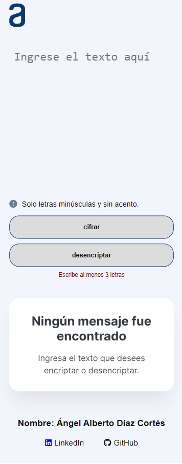
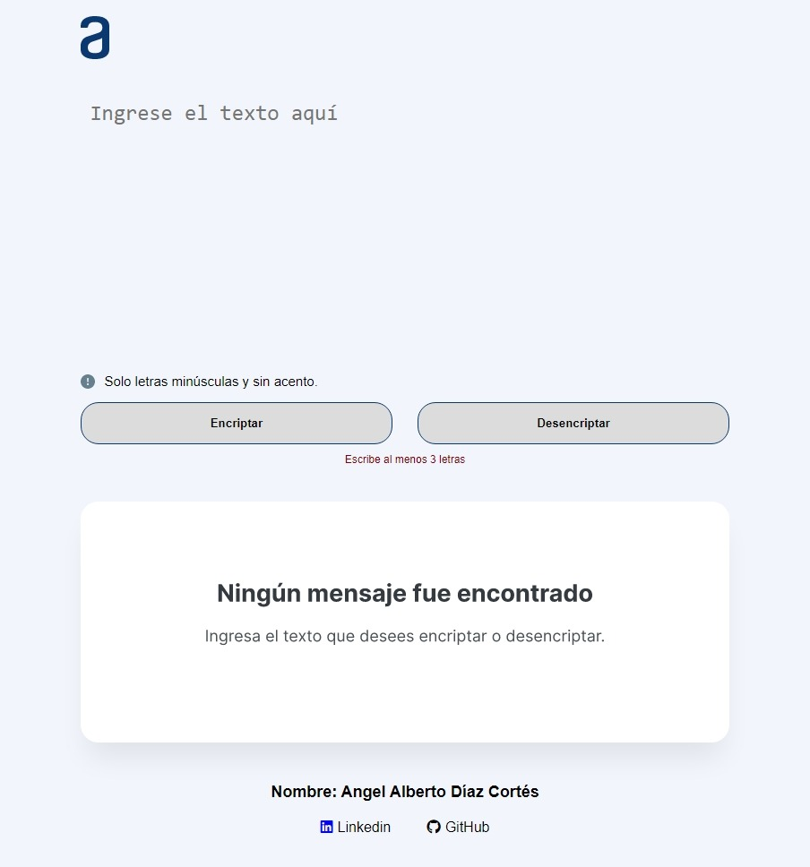
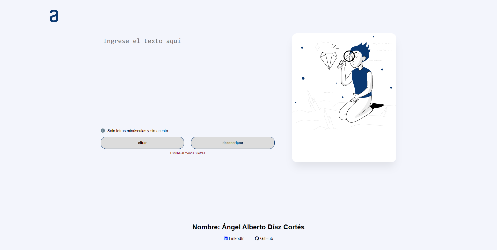

# Challenge 01 - Encriptador

Link del proyecto: [https://angeldiaz-21.github.io/Challenge01-encriptador/](https://angeldiaz-21.github.io/Challenge01-encriptador/)

El challenge consiste en crear una aplicación que encripta textos. Las llaves de encriptación que se utilizarán son las siguientes:
* La letra "e" es convertida para "enter"
* La letra "i" es convertida para "imes"
* La letra "a" es convertida para "ai"
* La letra "o" es convertida para "ober"
* La letra "u" es convertida para "ufat"

## Requisitos
* Debe funcionar solo con letras minúsculas.
* Debe ser posible convertir una palabra para la versión encriptada y también devolver una palabra encriptada para su versión original.
    Por ejemplo:
    "gato"     => "gaitober"
    "gatoiber" => "gato"
* La página debe de tener campos para la inserción del texto que será encriptado o desencriptado y el usuario debe de pode escoger entra estas dos opciones.
* El resultado debe ser mostrado en la pantalla.
* Un botón que copie el texto encriptado/desencriptado para la sección de transferencia, o sea, que tenga la misma funcionalidad que `ctrl + C` o de la opción copiar.

## Funciones
**Función btnEncrypt**
Dentro de la función btnEncriptar se declará una constante llamada `textToEncrypt` y se le asigna el valor de `textWrite` que sería el contenido del textarea la cuál contiene el texto a encriptar. Después se crea la variable llamada `matrizCodigo`, que contendrá la matriz de acuerdo a las llaves de encriptación que se vio en un principio, luego se crea una constante llamada `encryptedText` y se le asigna la función `replaceText` y se le envía como parámetro `matrizCodigo` y `textToEncrypt`. De forma general la función `replaceText` permite hacer la "encriptación", es decir, reemplaza las letras que encuentre en el textarea por las indicadas en la `matrizCodigo`, por ejemplo, si encuentra una *e* la reemplazará por *enter* y así sucesivamente. Por último, se llama la función `stylesOfTheResultMessage` y se envía como parámetro `encryptedText` que sería el texto encriptado para que se pueda mostrar en el otro textarea con la clase `textResult`. De esta manera funciona la lógica del botón encriptar.

**Función btnDesencrypt**
En un principio se declará una constanete llamada `textToDesencrypt` y se le asgina el valor de `textWrite` que sería el contenido del textarea la cuál contiene el texto a desencriptar. Después se crea la variable `matrizCodigo` que contiene las llaves para desencriptar, luego se crea una constante llamada `desencryptText` y se le asigna la función `replaceText` y se le envía como parámetro `matrizCodigo` y `textToEncrypt` y de la misma manera reemplaza las palabras que encuentre en el textarea por las indicadas en `matrizCodigo`, en esta ocación si encuentra un "enter" lo reemplazará por una "e" y asi sucesivamente sucede con las demás. Aquí también se llama la función `stylesOfTheResultMessage` y se envía como parámetro `desencryptText` que sería el texto desencriptado para que se pueda mostrar en el otro textarea con la clase `textResult`.

**Función replaceText**
Está función de forma general reemplaza el texto de acuerdo a la `matrizCodigo` que se reciba, ya sea para encriptar o desencriptar. Recibe como parámetros `matrizCodigo` que como ya se mencionó contiene las llaves para encriptar o desencriptar y `text`. `text` se tranforma a minúsculas con el método `toLowerCase` y luego se crea un `for`, en donde el `for` se dejará de ejecutar hasta que el index sea menor que el tamaño de `matrizCodigo` y dentro del `for` se crea un `if` en donde se toma `text` y se usa el método `includes`, el cuál recibe como parámetro `matrizCodigo`, es decir, con el método `includes` se verifica si en `text` existen las palabras que se encuentran en `matrizCodigo` en la posición 0 mientras que el index nos permite recorrer la matriz.
* Si `includes` devuelve `true` entonces se utiliza el método `replaceAll`, el `replaceAll` recibe 2 parámetros, el primero es el valor a reemplazar (que en este caso sería el valor de `matrizCodigo` en la posición 0) y el segundo es el nuevo valor por el cuál se va a reemplazar (que en este caso sería el valor de `matrizCodigo` en la posición 1). Por último, hace un `return` de `text`.
* Si includes devuelve `false` desde un principio se sale de la condición y hace un `return` de `text`.
El proceso para encriptar y desencriptar sucede de forma similar, así que la función `btnEncrypt` y `btnDesencrypt` usan esta misma función, lo único que cambia es la `matrizCodigo` que se recibe.

**Función stylesOfTheResultMessage**
Recibe como parámetro `text` que se va a mostrar en el otro texarea, ya sea como texto encriptado o desencriptado. Así que al momento de mostrar el texto, al textarea se le asigna el estilo de `backgroundImage` none para que desaparezca la imagen de fondo y al botón para copiar se le asigna el estilo de `display` block para que aparezca, ya que en un principio se encuentra oculto y también se le asigna un `margginBottom` de 15px.

**Función btnCopy**
Es una función asincrona ya que utiliza la función `clipboard` y se expone a través de la propiedad global `Navigator` y a su vez se utiliza el método `writeText`, este método escribe texto en el portapapeles del sistema, devolviendo una `Promise` que se resuelve una vez que el texto se copia completamente en el portapapeles. Dentro de este método se indica que va a copiar el valor que contenga `textResult` que sería el textarea donde se muestran los textos encriptados o desencriptados. También se indica que una vez que se copie el texto el textarea se quede en blanco, el botón de copiar desaparezca con la propiedad `display` none, muestre un alert indicando que el texto ha sido copiado y se llama la función `getScreenSizeToChangeImage` para volver a colocar la imagen de fonde del texarea dependiendo del tamaño del pantalla.

**Función getScreenSizeToChangeImage**
Esta función permite obtener el tamaño de pantalla y al momento de ejecutar esta función puede mostrar en el textarea una imagen de fondo dependiendo del tamaño de pantalla. Esto se logra con el operador condicional `if` y `ternario`.

**Función validationToActivateButtons**
Esta función permite activar los botones cuando el valor del textarea en donde se escribe tenga un valor mayor o igual a 3 caracteres, si no es así o se borrar un caracter se vuelven a desactivar los botones. Esto se logra mediante un `if`.

## Resultados
Este proyecto cuenta con diseño responsivo así que a continuación se muestran los resultados:

**Dispositivos menores a 720px**

**Dispositivos mayores a 720px**

**Dispositivos mayores a 1200px**

